|  |  |
|:-:|:-:|
|  |  |
| 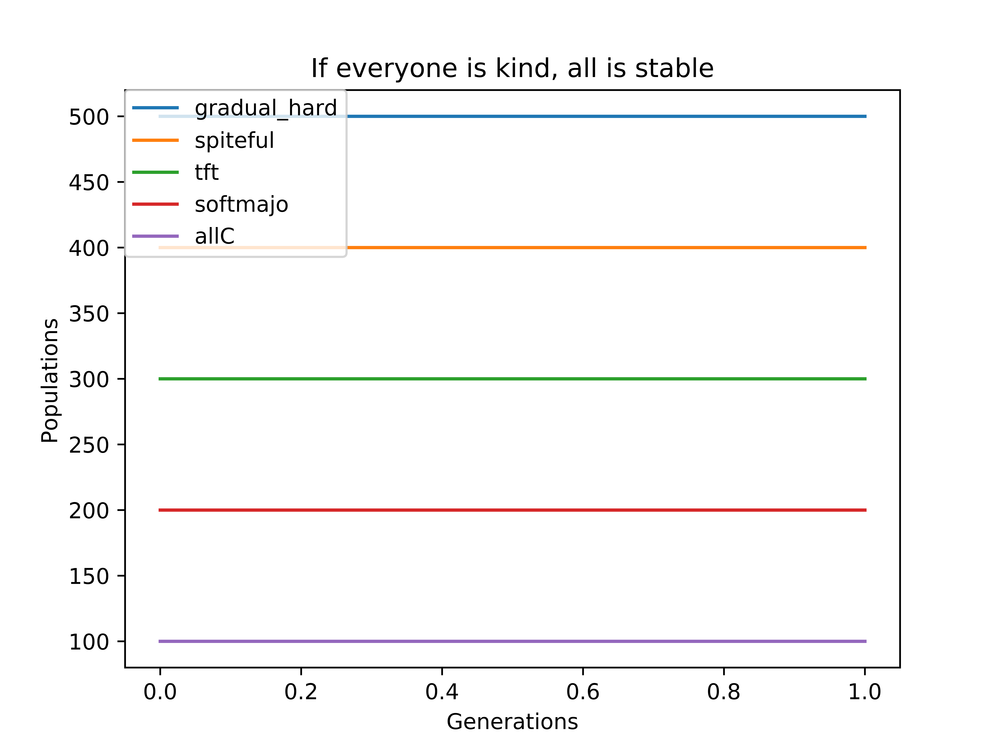 | |
|  | 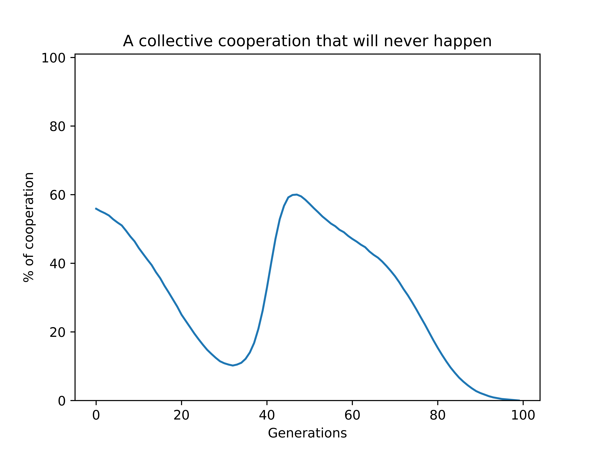 |
|  published in [EP 1998: Evolutionary Programming VII pp 33-41](https://link.springer.com/chapter/10.1007%2FBFb0040757) | 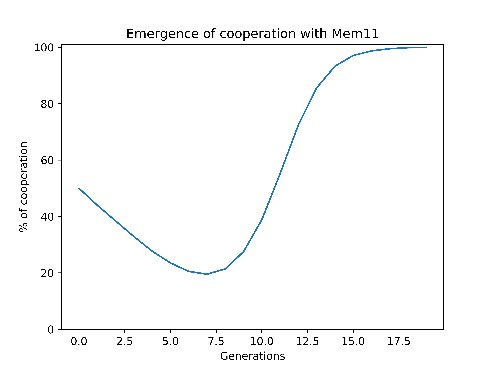 |
|  published in [EP 1998: Evolutionary Programming VII pp 33-41](https://link.springer.com/chapter/10.1007%2FBFb0040757)|  |
|  |  |
| 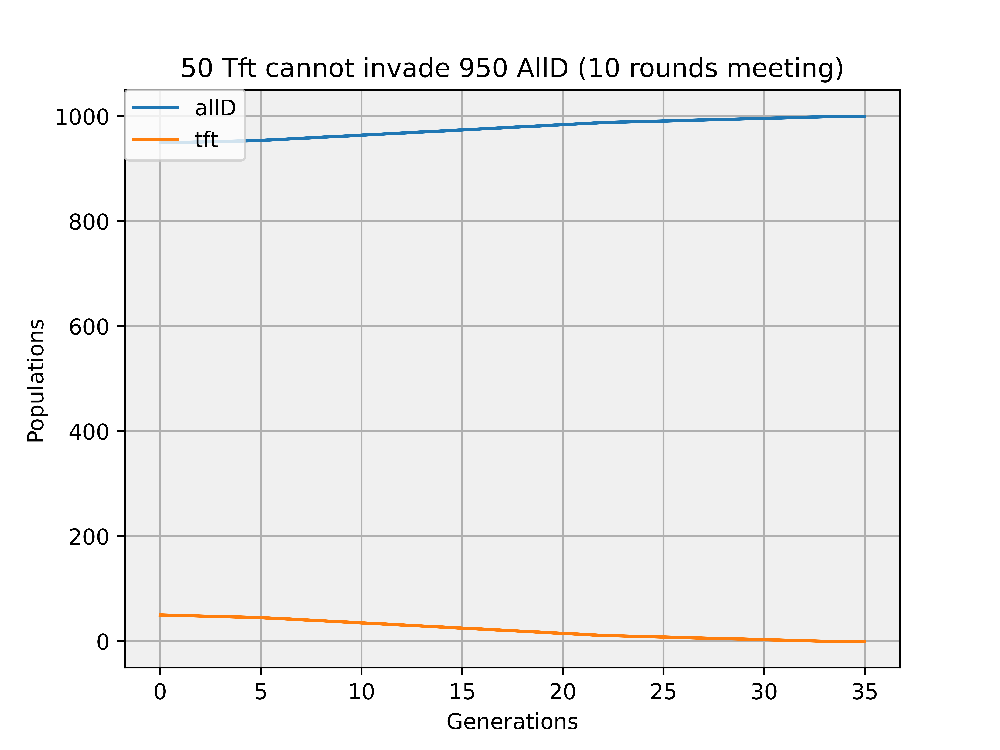 | 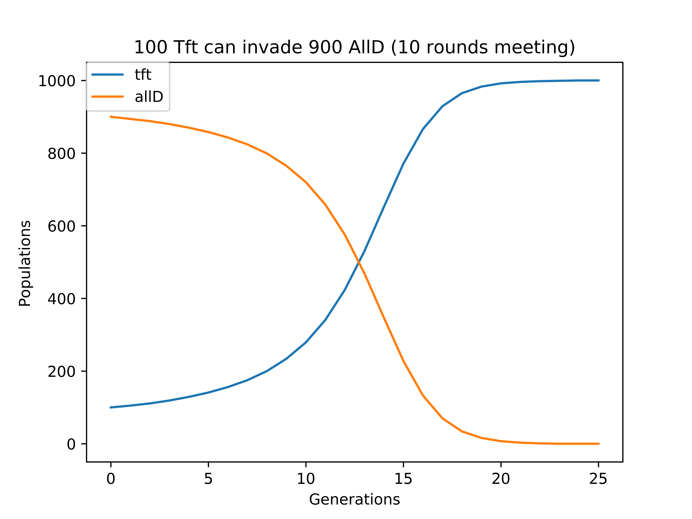 |
| 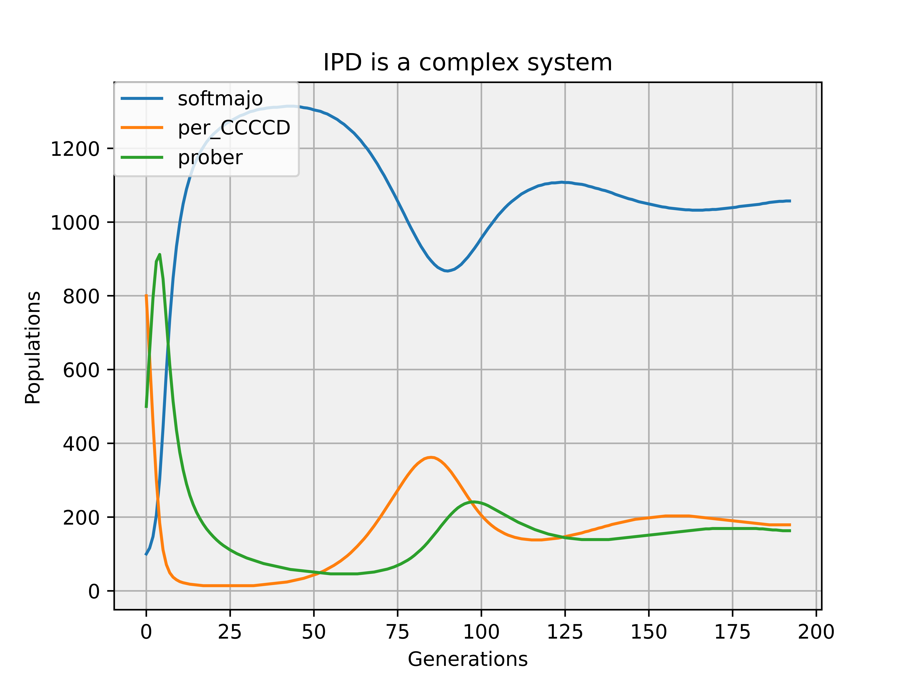 published in [AE 1999: Artificial Evolution pp 177-190](https://link.springer.com/chapter/10.1007%2F10721187_13) | 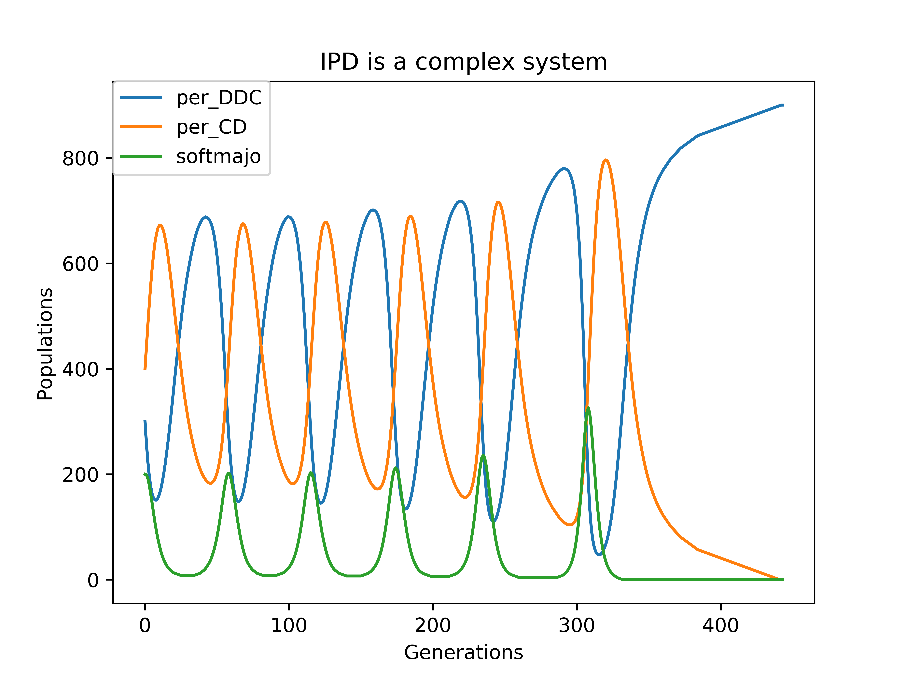 published in [AE 1999: Artificial Evolution pp 177-190](https://link.springer.com/chapter/10.1007%2F10721187_13)  |
| 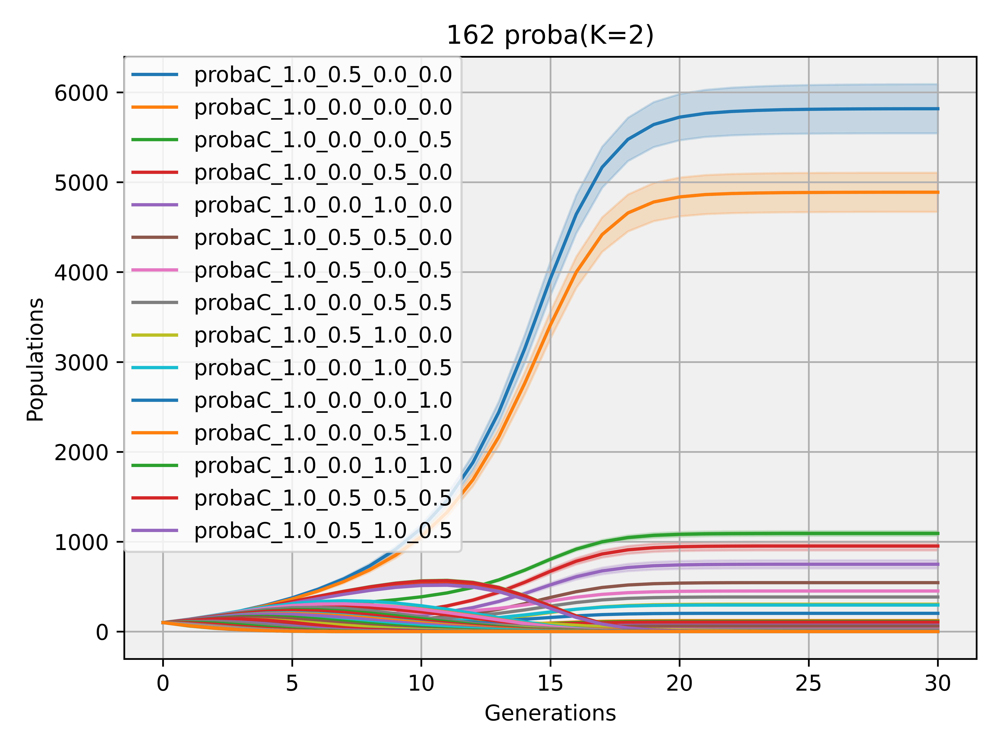 Published in [Simpat 2019 vol 97 pp 101946](https://doi.org/10.1016/j.simpat.2019.101946) | 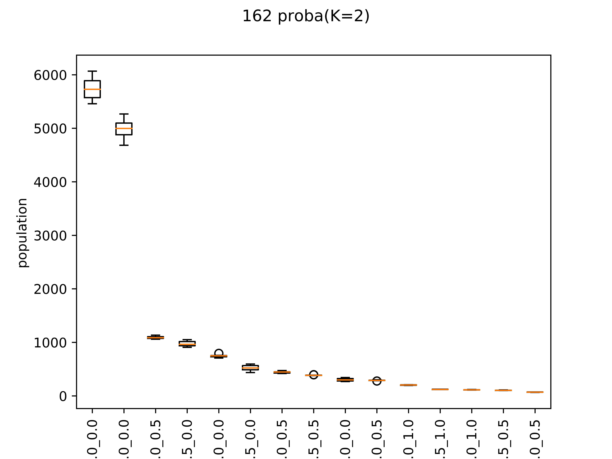 |
| 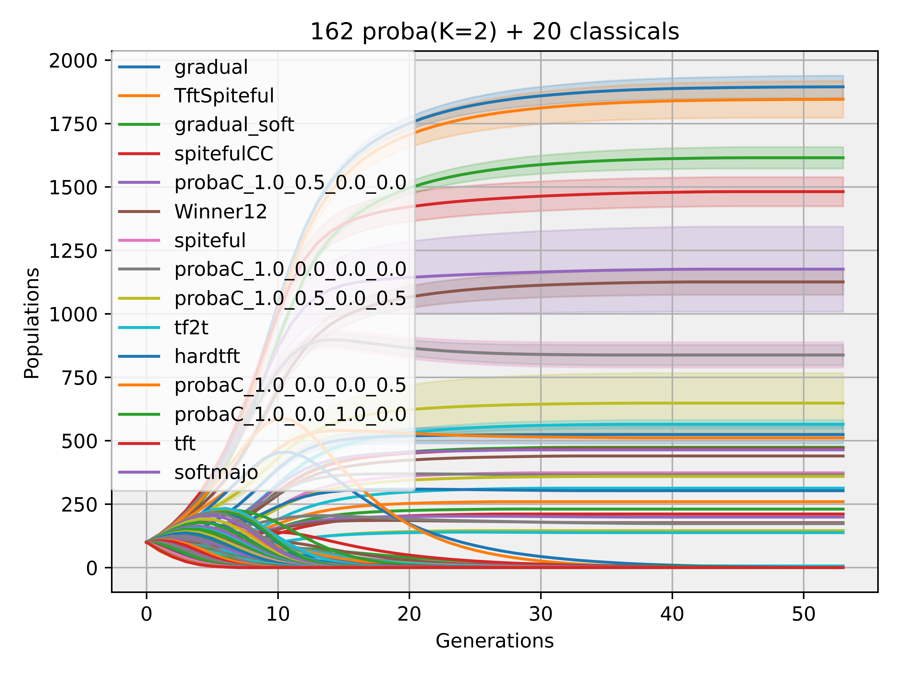 Published in [Simpat 2019 vol 97 pp 101946](https://doi.org/10.1016/j.simpat.2019.101946) | 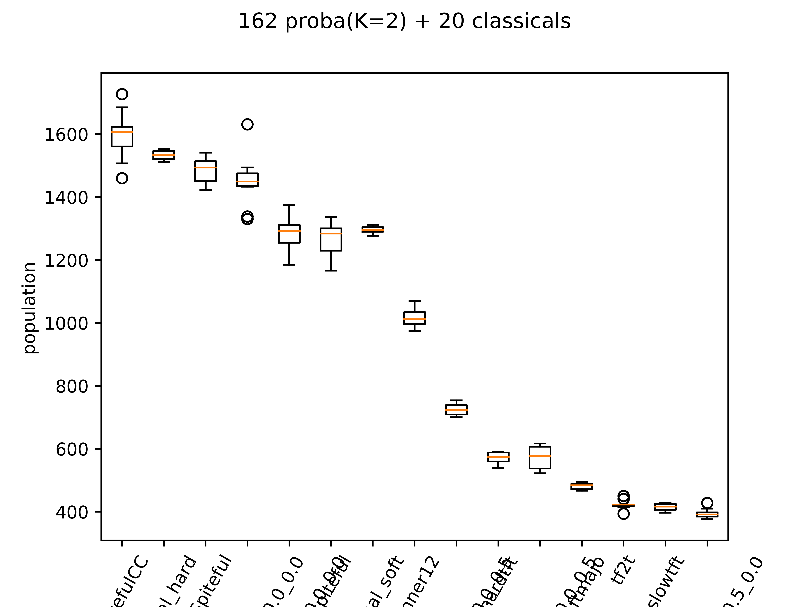 |
